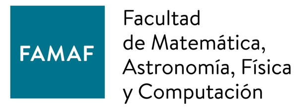
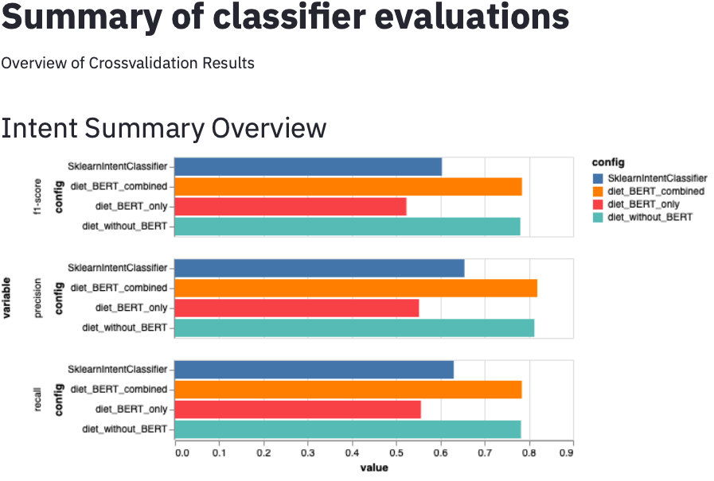
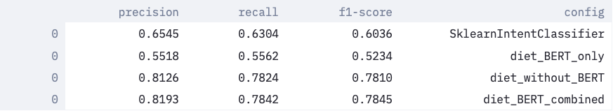
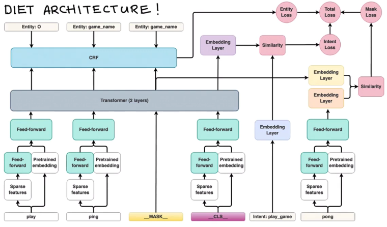
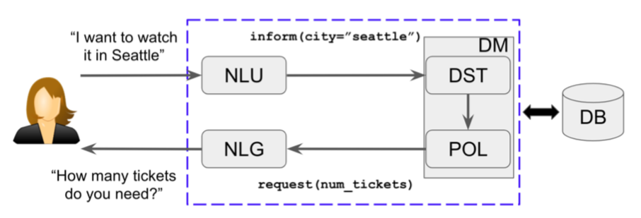

# The Conversational AI Pipeline



### **By Brandon Janes**

### **Final project for the course *Minería de texto* (Text Mining) 2019**

### *La Facultad de Matemática, Astronomía, Física y Computación de la Universidad Nacional de Córdoba* (The College of Mathematics, Astronomy, Physics and Computation, The National University of Córdoba) 

### professors: **[Laura Alonso Alemany](https://cs.famaf.unc.edu.ar/~laura/)** and  **[Cristian Cardellino](https://crscardellino.github.io/)**

OUTLINE:<br/>
**Section 1 - Introduction**<br/>
**Section 2 - Word representations**<br/>
    2.1 Maria Luisa<br/>
    2.2 Machine Translation<br/>
**Section 3 - Task-Oriented Chatbots**<br/>
    3.1 Natural Language Understanding and Dialogue Management<br/>
    3.2 The Conversational AI Pipeline<br/>
    3.3 Pretrained word embeddings<br/>
    3.4 Transformer for dialogue<br/>
    3.5 Dialogue management: tracker, slots and dispatcher<br/>
**Section 4 - Challenges**<br/>
	4.1 Virtual assistants in production<br/>
	4.2 Auto-configuration<br/>
	4.3 NER for persons’ names<br/>
**Section 5 - Conclusion** <br/>

## Introduction

The goal of this project was to create a high-performing dialogue system for appointment scheduling. The python library [Rasa](https://rasa.com/) was chosen because it is fully customizable, uses the latest developments in word embeddings and dialogue management, provides comprehensive model evaluation tools and it is open-source. Rasa is a framework that streamlines model training for Natural Language Understanding (NLU), Named Entity Recognition (NER) and Dialogue Management (DM), the essential tools for task-oriented dialogue systems. 

The biggest challenge specific to task-oriented dialogue systems is the inter-reliance of the three Natural Language Processing models: NLU, NER and the DM; if one begins to fail the other two will begin to fail as well. This problem was apparent at the early stages of the project and solving it required a deep exploration of each component used in the NLP pipeline: tokenizers, featurizers, entity extractors and classifiers, which included word embeddings and transformers. 

This project led to the development of the product, which I developed with my team at [Kunan S.A.](https://www.kunan.com.ar/), called myturn. This report describes how the myturn dialogue system was developed, how it works and the challenges we face moving forward in development. 

## Section 2 - Word representations

### Maria Luisa 2.1

The project started with a data set of 300 WhatsApp messages sent between customers and employees at a beauty clinic or centro de estetica in Córdoba, Argentina. Upon evaluation it was clear that the messages were primarily concerned with scheduling appointments. As the dataset grew and I tried more sophisticated training algorithms and NLP components, such as FastText word embeddings, I developed a classifier, similar to the Natural Language Understanding or NLU classifier we would later deploy in our dialogue system; the resulting [fastText](https://fasttext.cc/) trained classifier performed with an F1 score of 82 percent. This initial model was integrated into the company’s Customer Resource Management (CRM) system and currently provides them with NLP-based analytics.

This naive experiment established the objective of my research: to create a fully automated virtual assistant for appointment scheduling. 

### Machine Translation 2.2

Next, I experimented with a dialogue machine using the TensorFlow Seq2Seq (sequence-to-sequence) bidirectional Long Short-Term Memory (bi-LSTM) recurrent neural network machine translation model architecture. Machine translation generally uses dual-language texts, e.g. the European parliamentary translations, as training data. However, we did not use this bi-LSTM for translation. Basing my dialogue machine on [DeepQA](https://github.com/Conchylicultor/DeepQA), a project developed by Etienne Pot at Google Brain, I trained my “translation” machine with incoming and outgoing messages from our centro de estetica dataset.

This project yielded interesting results, but ultimately the model performance was too unstable to put into production. That being said, my experience with bi-LSTM recurrent networks served me in the next stage of the project as it proved the power of recurrent neural networks in modelling sequential data. In this experiment, I also explored the [self-attention](https://arxiv.org/pdf/1706.03762.pdf) feature of Tensorflow’s Seq2Seq architecture; this is the central strategy of transformer architectures, such as [BERT](https://arxiv.org/pdf/1810.04805.pdf) (see section 3.3). Ultimately, transformer-based word representations would be used in our dialogue system.

## Section 3 - Task-Oriented Chatbots 

### Natural Language Understanding and Dialogue Management 3.1

[Further research](https://arxiv.org/pdf/1809.08267.pdf) into chatbots lead to the discovery of task-oriented chatbots and the python library Rasa. Task-oriented chatbots differ from other chatbot systems in that they have a well established purpose and throughout the dialogue users are nudged to complete specific tasks, such as scheduling an appointment.

Treating the task as a series of classification problems, task-oriented chatbots rely on three classifiers: the Natural Language Understanding (NLU), entity extraction using Named Entity Recognition (NER) and Dialogue Management (DM). Dialogue management allows for “policies” or rules to the dialogue flow that can be hard-coded into the system. 

Each of these tools taken individually are extremely powerful NLP enablers. With Rasa’s open-source community-based product, Rasa stack, a non-specialist software developer can create a professional working grade virtual assistant for simple tasks within a few hours. 

### The Conversational AI Pipeline 3.2

The Rasa python library allows the developer to customize his or her pipeline and even develop his or her own custom components (see section 4.3). The package also provides comprehensive model evaluation tools that bring hundreds of data points together into confusion matrices and histograms (see [results](https://github.com/bubjanes/conversational_ai_pipelines/tree/master/results)); it provides training data validation that identifies out-of-place training data or intents (the categories classified by the NLU) that could be too dominant or too often overlooked by the model (see section 4.2).

In 2020, Rasa released a special multitask transformer architecture called the Dual Entity-Intent Transformer or DIET that has increased our model’s overall accuracy in both entity extraction and intent classification by more than 30 percent (compare results/**SklearnIntentClassifier** with results/**diet_without_BERT** in Fig. 3.1). The model architecture also allows for pretrained word embeddings, which is particularly useful in project when little training data is available.

### Pretrained word embeddings 3.3

In the featurization steps of the NLU pipeline, Rasa allows for pretrained word embeddings as well as training for custom features using n-grams or character-grams or a combination of these. With Rasa’s easy-to-use configuration, all of the available pretrained word embedding packages, BERT, GloVe or ConveRT, can be used in a sort of plug and play manner. As these word representations have been pretrained on large data sets, such as Wikipedia, they work exceptionally well for general English, but not so well with informal language or regional dialects. 


<br/>
**Fig. 3.1**<br/>

While HuggingFace makes available packages for pretrained word embeddings for languages other than English. However in my research, using these BERT pretrained word embeddings alone did not provide the best results (see results/**diet_BERT_only**), perhaps because of regional jargon and colloquialisms found in the informal Spanish language chats in Córdoba, Argentina, from where our data was taken. The multilingual pretrained BERT embeddings we used were “trained on cased text in the top 104 languages with the largest Wikipedias,” according to the HuggingFace documentation.

The highest performing model we obtained was by training our own custom features using DIET and then combining these supervised embeddings with the BERT pretrained embeddings in a feed forward layer (see results/**diet_BERT_combined**). This option is ideal for Spanish language projects with little training data. That being said, the combined model performed only negligibly better than the model that used DIET with no BERT pretrained embeddings (see results/**diet_without_BERT**).


### Transformer for dialogue 3.4


Image Source: [Day 101 of #NLP365: In-Depth Study Of RASA’s DIET Architecture](https://towardsdatascience.com/day-101-of-nlp365-in-depth-study-of-rasas-diet-architecture-3cdc10601599)

The transformer is a machine learning model architecture similar to a recurrent neural network, but it relies primarily on the attention mechanism mentioned above (see section 2.2). Transformers have come to replace the bi-LSTM architecture as the state-of-the-art machine learning model architecture for NLP. Not only does Rasa provide the pretrained word embedding that are trained, by HuggingFace, with the BERT transformer, but the DIET architecture can be configured to use one or more transformer layers in it’s own the intent classification and entity extraction. This is the distinct feature of the DIET architecture: a transformer architecture optimized to tackle the dual problem of intent classification and entity extraction.

### Dialogue management: tracker, slots and dispatcher 3.5


Image Source: [Neural Approaches to Conversational AI](https://arxiv.org/pdf/1809.08267.pdf)

Once the intent and entity classification or NLU has done its work, the system passes the message to the Dialogue Manager or the “memory” where another classifier, trained on “stories” or developer-composed dialogue flows. This “memory” occurs within what is called the **tracker** and entities are stored into **slots** e.g. ```inform(city=”seattle”)``` above. 

By way of the so called **dispatcher** system, the information stored in these slots, in coordination with the corresponding intents, can be sent to a python script where custom actions can be executed, such as API calls. In the case of myturn, once the user mentions the service they are interested in and the extraction is made, myturn’s **dispatcher** pulls the slot information from the tracker and calls the Google Calendar API to check for available appointments in that service. After several more similar steps, the appointment is made and confirmed by the user, updating Google Calendar. 

This is just one simple example of the infinite possibilities of dialogue system technology. The tracker and dispatcher systems are what connect the chatbot to all of the tools and functionalities available in python programming. However, these tools are only as powerful if the NLU models for intent classification and entity extraction can do their job well.

## Section 4 - Challenges 

### 4.1 Virtual assistants in production

At Kunan S.A., we have developed three dialogue systems, two [scheduling bots](https://ia.kunan.com.ar/) and one [FAQ bot that communicates information related to COVID-19](https://asistocovid.com.ar/) and the measures the government is taking with respect to the pandemic. As the artificial intelligence team at Kunan has grown, the project has advanced to many new horizons, and we continue to encounter new and interesting challenges. Among those challenges related to NLP, we want to allow users without NLP knowledge to configure their own assistants; we also strive to improve the model’s accuracy in extracting person’s names. 

4.2 Auto-configuration

The two primary tasks required for configuring myturn are the creation of intents and the formulation of responses, the former of which requires some knowledge of machine learning to do well. At Kunan we are approaching the development of user interfaces to allow the layman to configure the intents required for their assistants, but there are some complications. On one hand, virtual assistants should be designed from the client’s perspective, as they are most likely to be experts of their domain, on the other hand a certain degree of understanding of machine learning is necessary. Classification, or more specifically the labeling of documents in a supervised classification setting is subjective. If this process is not done with an eye towards NLP and machine learning, the resulting systems are most often low performing. 

4.3 NER for persons’ names 

In many cases, clients would need or want a virtual assistant to extract the names of its users. However extracting people’s names is complicated by the immense variety of persons’ names on planet Earth, and the potential confusion of those names with other words, e.g. Larry Page. Even if our person’s name entity extractor performs with 99 percent accuracy, that would mean that one in every 100 users cannot use our product, which is not acceptable.

At Kunan, we plan to create a Latin American persons’ name entity extraction custom component that can be plugged into a dialogue system, such as Rasa. This will involve obtaining a massive data set of Latin American names and pretraining it using a combination of a transformer, such as BERT, and a Conditional Random Fields extractor. We would make both the dataset and the Latin American names custom component available online free and open source. 

## Section 5 Conclusion 

With exciting advancements in NLP, such as transformers and pretrained word embeddings, the field of conversational artificial intelligence has leaped forward inrecent years, from bots that say, “Sorry, I don’t understand,” to truly becoming feasible solutions to daily tasks that once required tedious human work. Philosophically, the goal of this technology is not to replace humans with robots, but rather to assign the repetitive and “robotic” daily tasks, such as data entry or scheduling appointments, to virtual assistants, and reserve the brainspace of humans for the types of work that require skills that only humans have, such as creativity and critical thinking. I hope myturn is a simple but prescient example of how conversational AI could soon become a part of our daily lives.

---------------------
###### To view the results in this repo:

```
pip install streamlit
streamlit run viewresults.py
```

###### To learn more about Rasa pipelines, I recommend this great [YouTube tutorial](https://youtu.be/oj5oPGDlep4) by Vincent Warmerdam, of Rasa, and his accompanying [gist](https://gist.github.com/koaning/81fc9433182ccfb9dece4bb4dbde1f7a) from where I took the starter code for the streamlit ```viewresults.py```.

---------------------

## Bibliography

Tom Bocklisch, Joey Faulkner, Nick Pawlowski, Alan Nichol, *Rasa: Open Source Language Understanding and Dialogue Management*, 15 December 2017<br/>

Ashish Vaswani, Noam Shazeer, Niki Parmar, Jakob Uszkoreit, Llion Jones, *Attention Is All You Need*, 6 December 2017<br/>

Jianfeng Gao (Microsoft), Micahel Galley (Microsoft), Lihong Li (Google), *Neural Approaches to Conversational AI: Question Answering*, Task-Oriented Dialogues and Social Chatbots, 10 September 2019<br/>

Jacob Devlin Ming-Wei Chang Kenton Lee Kristina Toutanova of Google AI Language, *BERT: Pre-training of Deep Bidirectional Transformers for Language Understanding*, 11 October 2018


```bert-base-multilingual-cased```

Trained on cased text in the top 104 languages with the largest Wikipedias